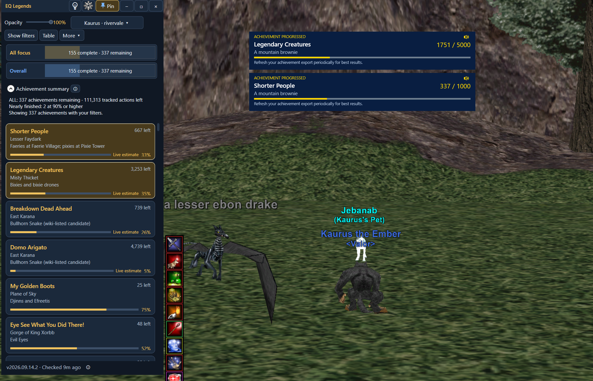
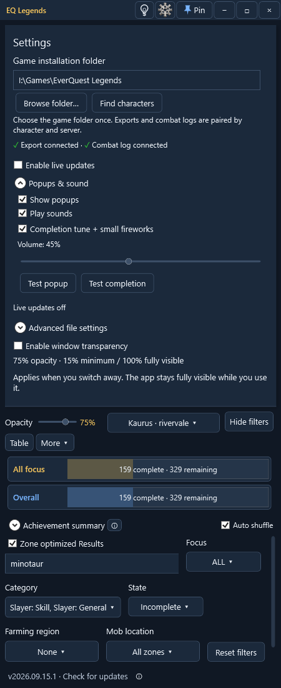
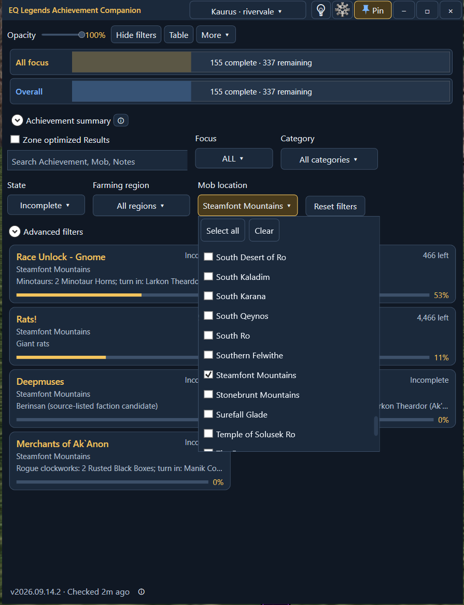
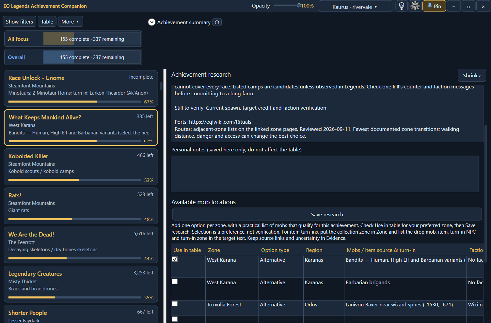
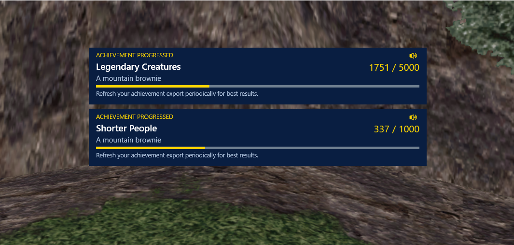

# EQ Legends Achievement Companion

A portable Windows achievement tracker for EverQuest Legends, with character profiles, farming locations and live combat-log estimates.

[Download the latest release](https://github.com/Kaurus2/eq-legends-achievement-companion/releases/latest) · [Illustrated App Guide](docs/EQ%20Legends%20Achievement%20Companion%20-%20Easy%20Guide.pdf) · [Watch the gameplay video](https://www.youtube.com/watch?v=4GrrluSXVvk)

## See it in action

[](https://www.youtube.com/watch?v=4GrrluSXVvk)

User-provided gameplay demonstration. Click the image to watch on YouTube.

## Get started

Extract the entire release ZIP and run **EQ Legends Achievement Companion.exe**. Open the clockwork gear, choose your game folder, and select your character. Export achievements in game and enable `/log on` for live estimates. No installer is required.

## What you can do

- Keep a compact single-column tracker beside the game or expand into multiple columns.
- Search and multi-select categories, regions and zones; retain filters across restarts.
- Use Auto shuffle for recent progress, or drag tiles into a saved per-character order.
- Open a tile for farming alternatives, routes and personal notes.
- Use independent live tracking, popup and sound switches with automatic Settings saving.
- See stacked progress popups and completion effects; mute with the popup speaker icon.
- Switch blue-and-gold light/dark themes, pin the window, and adjust unfocused opacity.

### Settings

Settings opens inside the app, keeps the current theme, and pushes tracker content down. Expand **Popups & sound** for switches, volume and test buttons.



### Filters and farming alternatives



The zone checklist supports multiple selections. The current release adds a search box above the choices. **Zone optimized Results** uses matching location alternatives temporarily; turning it off restores the preferred selection.



Research changes still use **Save research**. Personal notes do not alter the main table.

### Progress notifications



Up to three popups appear at once. Arrivals are staggered, each remains for eight seconds, and remaining notifications move up as others fade away.

## Accuracy and data

The achievement export is the confirmed baseline. Live counts are estimates from recognized kill names and owned-pet messages. Refresh the export periodically. Generic bandits do not identify their race, so the app does not guess their race credit.

Location research includes community leads and explicit uncertainties, not guaranteed spawn, faction or credit information. The Wood Elf/High Elf bandit recommendations were withdrawn after a user reported no progress in a fresh export. No replacement farm is claimed as verified.

Shared release data has personal notes and selections cleared. Character exports, combat logs, settings, caches and backups are not published. The app reads game files without editing them.

## Updating

The bottom-left footer automatically checks for a release. **Start update** appears when one is available; installation requires your click. The download is verified against GitHub's SHA-256 asset digest, and the old executable is backed up. Saved data is retained.

The in-app updater replaces the executable only. Download the release ZIP for the latest illustrated guide and shared documentation. Use **More > App Guide** to open the installed PDF.

## Build and test on Windows

Requires .NET Framework 4.x WPF and its C# compiler.

```powershell
.\src\build.ps1
& '.\EQ Legends Achievement Companion.exe' --test
```

Tests use an isolated data directory. Use a separate extracted release folder for play. Release packages contain the executable, shared data, and documentation; source is in this repository.
